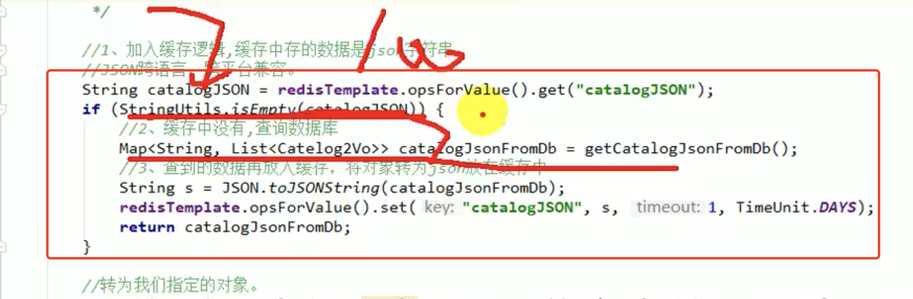
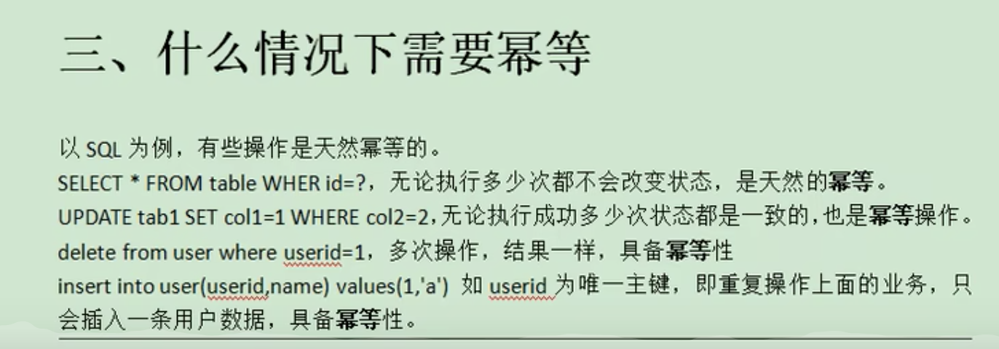
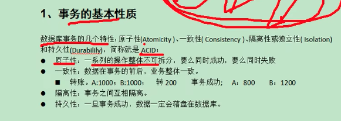

## [155、缓存-缓存使用-缓存击穿、穿透、雪崩11:27](https://www.bilibili.com/video/BV1np4y1C7Yf?p=155)

缓存穿透： **产生的原因，没有将数据为空的数据写入缓存。**


缓存雪崩：相同的时间点大量key同时过期，大面积缓存失效。


**缓存击穿：热key在大量请求到来前正好失效，导致大量请求直接打到数据库。**


## [156、缓存-缓存使用-加锁解决缓存击穿问题18:55](https://www.bilibili.com/video/BV1np4y1C7Yf?p=156)




## [157、缓存-缓存使用-本地锁在分布式下的问题03:58](https://www.bilibili.com/video/BV1np4y1C7Yf?p=157)


## [158、缓存-分布式锁-分布式锁原理与使用40:45](https://www.bilibili.com/video/BV1np4y1C7Yf?p=158)


**删除别人的锁：**


使用 lua 脚本删锁解决上面的问题：


总结：


## [159、缓存-分布式锁-Redisson简介&整合13:32](https://www.bilibili.com/video/BV1np4y1C7Yf?p=159)


配置自动解锁后不会自动续期。


未设置超时时间时看门狗线程的核心方法：


### org.redisson.RedissonLock#tryAcquireAsync

```java
private <T> RFuture<Long> tryAcquireAsync(long waitTime, long leaseTime, TimeUnit unit, long threadId) {
        RFuture<Long> ttlRemainingFuture;
        if (leaseTime > 0) {
            ttlRemainingFuture = tryLockInnerAsync(waitTime, leaseTime, unit, threadId, RedisCommands.EVAL_LONG);
        } else {
            ttlRemainingFuture = tryLockInnerAsync(waitTime, internalLockLeaseTime,
                    TimeUnit.MILLISECONDS, threadId, RedisCommands.EVAL_LONG);
        }
        CompletionStage<Long> f = ttlRemainingFuture.thenApply(ttlRemaining -> {
            // lock acquired
            if (ttlRemaining == null) {
                if (leaseTime > 0) {
                    internalLockLeaseTime = unit.toMillis(leaseTime);
                } else {
                    scheduleExpirationRenewal(threadId);
                }
            }
            return ttlRemaining;
        });
        return new CompletableFutureWrapper<>(f);
    }
```

**redission 看门狗机制是如何延时的：**

加锁成功后会进入这个方法，**看门狗工作的核心方法**：

org.redisson.RedissonBaseLock#renewExpiration

```java
private void renewExpiration() {
        ExpirationEntry ee = EXPIRATION_RENEWAL_MAP.get(getEntryName());
        if (ee == null) {
            return;
        }
        
        Timeout task = commandExecutor.getConnectionManager().newTimeout(new TimerTask() {
            @Override
            public void run(Timeout timeout) throws Exception {
                ExpirationEntry ent = EXPIRATION_RENEWAL_MAP.get(getEntryName());
                if (ent == null) {
                    return;
                }
                Long threadId = ent.getFirstThreadId();
                if (threadId == null) {
                    return;
                }
                
                CompletionStage<Boolean> future = renewExpirationAsync(threadId);
                future.whenComplete((res, e) -> {
                    if (e != null) {
                        log.error("Can't update lock " + getRawName() + " expiration", e);
                        EXPIRATION_RENEWAL_MAP.remove(getEntryName());
                        return;
                    }
                    
                    if (res) {
                        // reschedule itself
                        renewExpiration();
                    } else {
                        cancelExpirationRenewal(null);
                    }
                });
            }
        }, internalLockLeaseTime / 3, TimeUnit.MILLISECONDS);  // 不断注册定时任务，延期 10 s 执行
        
        ee.setTimeout(task);
    }
```

#### 看门狗机制源码分析

https://juejin.cn/post/6844904106461495303

#### 看门狗依赖的核心算法-时间轮算法

https://gentryhuang.com/posts/1d01ceec/index.html

>
>**HashedWheelTimer** 时间轮算法可以通过上图来描述。**假设时间轮大小为 8 即 8 个格子，1s 转一格，每格都对应一个链表，链表每个节点都保存着待执行的任务。某一时刻，时间轮走到编号为 2 的格子，此时添加了一个 3s 后执行的任务，对应 3 个格子，则 2 + 3 = 5，在编号为 5 的格子对应链表中添加一个任务节点即可，轮次 round 为 0 ；**如果添加一个 10s 后执行的任务，同理得 (2 + 10) % 8 = 4，在编号为 4 的格子对应的链表中添加一个任务节点，并标识轮次 round 为 1，当时间轮第二次经过编号为 4 的格子时就会执行该任务。注意，**时间轮只会执行 round = 0 的任务，并会把该格子上的其他任务的 round 减 1 。**
>
>## 流程图
>
>
>
>**HashedWheelTimer 是基于时间轮算法，提交的任务会被封装成 `HashedWheelTimeout` 对象并存放到全局任务队列中。时间轮的格子是用 bucket 数组表示，bucket 内部维护一个 `HashedWheelTimeout` 类型的双向链表，每一个节点都是一个 HashedWheelTimeout 对象。其内部使用一个工作线程自旋地进行 tick ，tick 到来后会先将全局任务队列中的任务添加到对应的 bucket 中，接着轮训当前 tick 对应 bucket 中的任务链表，执行轮次为 0 的任务，轮次非 0 的任务将其轮次减 1 。**
>
># 特点
>
>**优点**
>
>1 本地机器直接执行，效率非常高。
>2 无需扫描所有任务。通过将环切成 N 份，将查询到期延时任务的耗时降到 1/N，N 视任务量的大小可以灵活设置(1024,2048 等)
>
>**缺点**
>
>> 1 可靠性：
>> \- 机器重启，数据即丢失，可以使用 MySQL 等持久化存储，机器重启时从数据库 load 进内存。
>> \- 机器宕机，数据丢失，需要使用方自行处理，如由其它机器接管宕机机器的任务
>> 2 时间轮调度器的时间精度可能不是很高，对于精度要求特别高的调度任务可能不太合适。因为时间轮算法的精度取决于一次 tick 的时间。
>> 3 时间轮是通过单线程实现的，如果在执行任务的过程中出现阻塞，会影响后面任务执行。这个缺点也就是缺点 2 的直接体现。
>
># 小结
>
>时间轮算法不难理解，但 HashedWheelTimer 源码中有很多细节需要注意。任务的管理，体现在任务队列和 bucket 数组的使用；任务的触发，体现在工作线程自旋进行 tick ；**任务的执行，体现在工作线程轮询 bucket 的任务链表，对 TimerTask.run 的执行；需要注意的是，整个时间轮的调度都是在一个线程中完成的，因此对于那些耗时较大的定时任务会影响其他任务的正常触发和执行，但任务执行异常并不会导致工作线程退出，这是不同于 JDK 中的 Timer 。**

很明显，从上面标注的数字可以看出来：

①：这是一个任务。

②：这任务需要执行的核心代码。

③：该任务每 internalLockLeaseTime/3ms 后执行一次。而  internalLockLeaseTime 默认为 30000。所以该任务每 10s 执行一次。

步骤 2 定时任务的核心源码：

```java
protected CompletionStage<Boolean> renewExpirationAsync(long threadId) {
    return evalWriteAsync(getRawName(), LongCodec.INSTANCE, RedisCommands.EVAL_BOOLEAN,
            "if (redis.call('hexists', KEYS[1], ARGV[2]) == 1) then " +
                    "redis.call('pexpire', KEYS[1], ARGV[1]); " +
                    "return 1; " +
                    "end; " +
                    "return 0;",
            Collections.singletonList(getRawName()),
            internalLockLeaseTime, getLockName(threadId));
}
```


```java
public void expire() {
    if (this.compareAndSetState(0, 2)) {
        try {
            // 时间轮上每个 bucket 上单个任务执行的代码，可见，任务的执行是同步的，会让整个时间轮线程阻塞。
            this.task.run(this);
        } catch (Throwable var2) {
            if (HashedWheelTimer.logger.isWarnEnabled()) {
                HashedWheelTimer.logger.warn("An exception was thrown by " + TimerTask.class.getSimpleName() + '.', var2);
            }
        }

    }
}
```

## [172、缓存-SpringCache-原理与不足19:27](https://www.bilibili.com/video/BV1np4y1C7Yf?p=172)

添加 springcache 缓存组件：


只有在缓存读取时，才有相应的加锁的配置：


## [210、商城业务-商品详情-异步编排优化14:44](https://www.bilibili.com/video/BV1np4y1C7Yf?p=210) CompletableFuture


## [267、商城业务-订单服务-Feign远程调用丢失请求头问题27:35](https://www.bilibili.com/video/BV1np4y1C7Yf?p=268)


添加一个请求拦截器，把原来请求的 cookie set到新的请求头上去。


## [268、商城业务-订单服务-Feign异步调用丢失请求头问题18:40](https://www.bilibili.com/video/BV1np4y1C7Yf?p=269)

异步调用 threadlocal 里面就是 null。

解决方案：在异步线程里面，在做一次 threadlocal 的set 操作。


## [274、商城业务-订单服务-接口幂等性讨论25:26](https://www.bilibili.com/video/BV1np4y1C7Yf?p=275)





### 1. 令牌机制


### 2. 锁机制

#### 悲观锁、乐观锁


#### 分布式锁


### 3. 利用数据库唯一约束


### 4. 防重表


### 5. 全局请求唯一id


A 请求请求B请求，两次请求的 request_id 相同，b 即判断为 A 请求已经处理过了。

唯一 id 也可用于做链路追踪。

## [283、商城业务-分布式事务-本地事务在分布式下的问题14:13](https://www.bilibili.com/video/BV1np4y1C7Yf?p=284)


## [P284、商城业务-分布式事务-本地事务隔离级别&传播行为等复习18:39](https://www.bilibili.com/video/BV1np4y1C7Yf?p=285)



### **事务的隔离级别：**

读未提交  

#### 事务的传播行为


即使没有接口也能创建代理对象。

对外暴露代理对象：


```java
@Target(ElementType.TYPE)
@Retention(RetentionPolicy.RUNTIME)
@Documented
@Import(AspectJAutoProxyRegistrar.class)
public @interface EnableAspectJAutoProxy {

    /**
     * Indicate whether subclass-based (CGLIB) proxies are to be created as opposed
     * to standard Java interface-based proxies. The default is {@code false}.
     */
    boolean proxyTargetClass() default false;

    /**
     * Indicate that the proxy should be exposed by the AOP framework as a {@code ThreadLocal}
     * for retrieval via the {@link org.springframework.aop.framework.AopContext} class.
     * Off by default, i.e. no guarantees that {@code AopContext} access will work.
     * @since 4.3.1
     */
    boolean exposeProxy() default false;

}
```

这里简单介绍一下两个参数,**一个是控制aop的具体实现方式,为true 的话使用cglib,为false的话使用java的Proxy,默认为false,**

**第二个参数控制代理的暴露方式,解决内部调用不能使用代理的场景，默认为false**.

### [Spring] @EnableAspectJAutoProxy原理解析

 https://juejin.cn/post/6939152464394321956

>#### exposeProxy
>
>**为了解决一些由于代理引发的切面失效问题，`Spring AOP`在Spring 4.3.1后引入了`AopContext`类来将代理类的引用存储在ThreadLocal中，通过`AopContext`可以快速获取当前类的代理类.**
> 默认为不支持，如果声明为true，即可使用`AopContext`获取代理类.
>
>> 同时，为了使用AspectJ,需要确保当前jar仓库存在`aspectjweaver`.
>
>### 通过@Import注册AspectJAutoProxyRegistrar
>
>通常情况下，我们的启动类本身也是一个Bean，Spring支持使用`@Import`来导入一个没有标记任何Spring 注解的类来将该Java类注册成Spring的Bean.
> `@EnableAspectJAutoProxy`注解正是通过`@Import`的方式来将`AspectJAutoProxyRegistrar`类注册成Spring的Bean，以便在容器解析切面类时派上用场.
> 那么`AspectJAutoProxyRegistrar`类的作用是什么?
> 我们从JavaDoc中可以看到这样一句话:
>
>> Registers an AnnotationAwareAspectJAutoProxyCreator against the current BeanDefinitionRegistry as appropriate based on a given @EnableAspectJAutoProxy annotation.
>>  **根据当前BeanDefinitionRegistry在适当的位置注册AnnotationAwareAspectJAutoProxyCreator。**
>
>#### UML
>
>
>
>- **ImportBeanDefinitionRegistrar:** 用来导入一些特殊的BeanDefinition,Spring在处理`@Configuration`时，会去扫描是否有通过`@Import`标签导入的类，对`ImportBeanDefinitionRegistrar`这类接口，还会执行其中的`registerBeanDefinitions`方法.
>- **AspectJAutoProxyRegistrar:** 实现了`ImportBeanDefinitionRegistrar`接口，用来注册`AspectJAnnotationAutoProxyCreator`,也就是支持注解驱动(同时兼容XML)解析的AspectJ自动代理创建器.
>
>```java
>class AspectJAutoProxyRegistrar implements ImportBeanDefinitionRegistrar {
>
>	@Override
>	public void registerBeanDefinitions(
>			AnnotationMetadata importingClassMetadata, BeanDefinitionRegistry registry) {
>		// 向容器注册AspectJAnnotationAutoProxyCreator
>		AopConfigUtils.registerAspectJAnnotationAutoProxyCreatorIfNecessary(registry);
>
>		AnnotationAttributes enableAspectJAutoProxy =
>				AnnotationConfigUtils.attributesFor(importingClassMetadata, EnableAspectJAutoProxy.class);
>		// 如果@EnableAspectJAutoProxy上存在标签内容
>		if (enableAspectJAutoProxy != null) {
>			// 如果proxyTargetClass为true，则强制指定AutoProxyCreator使用CGLIB进行代理
>			if (enableAspectJAutoProxy.getBoolean("proxyTargetClass")) {
>				AopConfigUtils.forceAutoProxyCreatorToUseClassProxying(registry);
>			}
>			// 是否开启exposeProxy特性
>			if (enableAspectJAutoProxy.getBoolean("exposeProxy")) {
>				AopConfigUtils.forceAutoProxyCreatorToExposeProxy(registry);
>			}
>		}
>	}
>
>}
>
>```
>
>这里关键的地方就是通过`		AopConfigUtils.registerAspectJAnnotationAutoProxyCreatorIfNecessary(registry);`向容器注册`AspectJAnnotationAutoProxyCreator`.
> 随后解析`@EnableAspectJAutoProxy`注解上的元数据来决定是否开启上述我们讲到的`proxyTargetClass`和`exposeProxy`特性.

获取代理对象使用示例：


## [P285、商城业务-分布式事务-分布式CAP&Raft原理](https://www.bilibili.com/video/BV1np4y1C7Yf?p=286)

分布式系统里，肯定要满足分区容错性。所以需要在 可用性和一致性 中二选一。


分布式系统中实现一致性的算法 raft ，动画演示：

https://thesecretlivesofdata.com/raft/

*Raft* is a protocol for implementing distributed consensus.

主要涉及到：1. leader 选举  2. 日志复制

## [P287商城业务-分布式事务-BASE](https://www.bilibili.com/video/BV1np4y1C7Yf?p=287)


对大多数应用系统，可以舍弃 C 强一致性，但是可以保证最终一致性。


### [P288、商城业务-分布式事务-分布式事务常见解决方案](https://www.bilibili.com/video/BV1np4y1C7Yf?p=288)

### 1. 2PC ——— 可实现刚性事务


### 2. 实现柔性事务—— TCC 模式，TRY -> CONFIRM -> CANCEL

TCC 相当于3pc的手动版，手动准备数据、预提交、回滚。


### 3. 柔性事务——最大努力通知方案


执行失败的第三方服务不停地通知业务说 “实行失败了”，业务收到消息后将其他的服务执行回滚操作后，通知执行失败的第三方服务，停止发送消息。

### 4. 柔性事务—— 可靠消息+最终一致性方案 （异步确保型）


比如实现一个大订单服务，需要三个 子服务：订单服务、库存服务、用户服务。只要大订单整个业务有一个环境失败了，就给这些子服务发一条**可靠性消息**，让这些**子服务自己慢慢回滚数据就行**，实现**最终一致性**。

以上，三 四 方案的用时较多，可应用于并发量高的系统。

## [P288、商城业务-分布式事务-Seata&环境准备](https://www.bilibili.com/video/BV1np4y1C7Yf?p=289)

官网： https://seata.io/zh-cn/

Spring-cloud alibaba 提供的 Seata 主要是 2pc 模式的实现。


